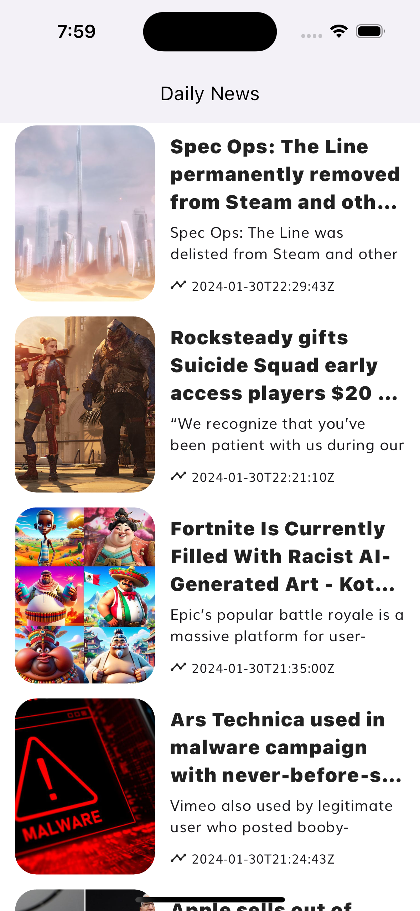

# News App - Clean Architecture 👋

A sample of clean architecture with bloc based on [Flutter Clean Architecture - Learn By A Project | Full Beginner's Tutorial](https://youtu.be/7V_P6dovixg?si=XEfyWrJDelNVqFiE)

 
  
  
  
  
  
   
     
    <a href="https://github.com/brsaca/news_clean_architecture/issues/new">Report bug</a>
    ·
    <a href="https://github.com/brsaca/news_clean_architecture/issues/new">Request feature</a>

## 📝 Description
Use of Bloc with Clean Architecture

## 💻 TODO
- Local database

## 👤 Author

**Brenda Saavedra**

- WebPage: [brendasaavedra.com](http://brendasaavedra.com)
- Github: [@brsaca](https://github.com/brsaca/)
